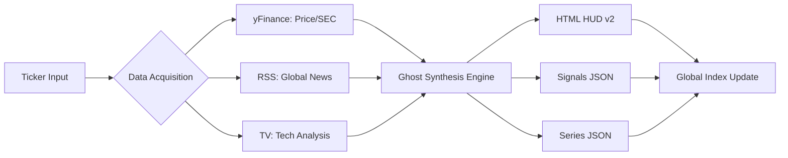

# 👻 GHOST PROTOCOL // ALPHA-PLAYBOOK GENERATOR
> **Institutional-Grade Intelligence. Single Command Execution.**

This isn't just a stock scraper. It's a **headless quant workstation** that synthesizes real-time market data, technical stacks, SEC filings, and global news into a high-density, "Cyber-Bloomberg" HUD.

---

## ⚡ THE ONE-COMMAND WORKFLOW
Generate a full research dossier, update the global index, and prepare for deployment with a single line:

```bash
python3 generate_playbook.py --ticker ACHR
```



---

## 🚀 CORE CAPABILITIES

### 📊 ADVANCED TECHNICAL MATRIX
We don't just look at price. We track the **Full Institutional Stack**:
- **EMA Stacks**: 8, 21, 34, 55, 89 (The Harmonic Hierarchy).
- **Price Benchmarking**: SMA 50 (Institutional Move) vs SMA 200 (The Line in the Sand).
- **Momentum & Volatility**: Calculated RSI 14, MACD Histograms, and a custom **HV vs IV Analysis** to detect volatility compression.
- **Fibonacci & Pivots**: Real-time calculated monthly pivots and 52-week Fibonacci retracements.

### 📰 AUTONOMOUS INTEL FEED
- **Multi-Source RSS Aggregation**: Bloomberg, WSJ, CNBC, FT, and SeekingAlpha.
- **Ticker-Specific Deep Dives**: Real-time filtration of Yahoo Finance news specific to the target asset.
- **Entity Linking**: News is linked and deduplicated directly into the HUD's Intel sidecar.

### 🏛️ FUNDAMENTAL & SEC INSIGHTS
- **SEC Filing Synthesis**: Automatically parses `yfinance` info into readable "Operations" and "Forward Looking" risk profiles.
- **Insider Activity Tracker**: Real-time monitoring of Form 4 filings with automated buy/sell sentiment scoring.
- **Valuation Consensus**: A blended model utilizing **Graham Number**, **Peter Lynch Fair Value**, and **Analyst Targets** to find the "Margin of Safety."

### 🤖 AI-GRADED VERDICTS
The "Ghost Quant" logic performs a final synthesis:
- **Rule-Based Scoring**: Technical (Trend/Momentum) and Fundamental (Margins/Growth) scores out of 100.
- **Execution Protocols**: Generates human-readable verdicts (e.g., *ACCUMULATE on Dips* or *DISTRIBUTE into Strength*) based on multi-factor analysis.

---

## 🛠️ ARCHITECTURE: DATA AS AN ENDPOINT
The system is designed for **Front-End Agnosticism**. Every run generates three artifacts:
1. **`HUD.html`**: The professional, glassmorphism "Command Center" UI.
2. **`[DATE].json`**: Minimized signals and narratives ready for any React/Vue/Mobile frontend.
3. **`[DATE]_series.json`**: Heavy time-series data for custom charting integrations (Plotly-ready).

---

## 📡 DEPLOYMENT
Optimized for **Public-but-Hidden** research portals:
- **Vultr / Web Server**: Automated `scp` syncing to live production directories.
- **GitHub Pages**: Headless portal generation via `index.html` updates.

---
*Generated by Sam the Ghost Quant*
