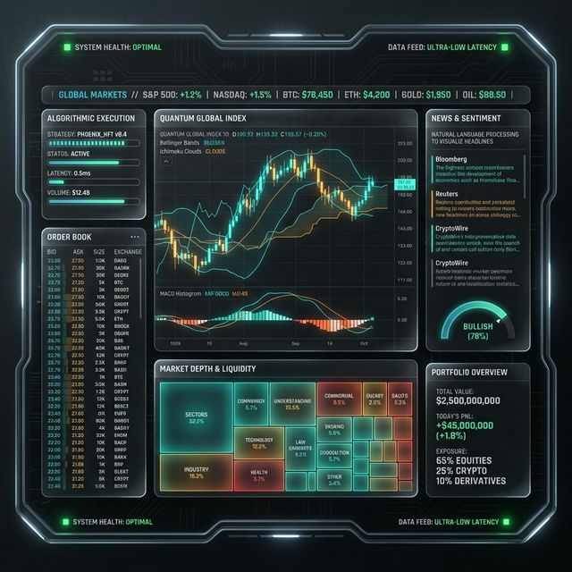

# 👻 GHOST PROTOCOL // ALPHA-PLAYBOOK
> **"I’m a trader and a coder, not a marketing guy."**

Let’s be real: I like the nerdy shit. I like digging into market mechanics, writing code that actually does something useful, and finding ways to stack "free shares" through discipline. What I *don't* like is the marketing hype and the endless manual grind of checking fifty different sites to get a single clear picture of an asset.

So I built this.

This is the **Alpha-Playbook**. It's the engine I use to turn a single ticker into a professional-grade research dossier in about 10 seconds. No fluff, no noise—just the mechanics.

---

## ⚡ WHAT IT DOES (FOR ME)
I needed a single "Command Center" that could do the heavy lifting:
- **Real-Time Technicals**: Full EMA stacks (8, 21, 34, 55, 89), RSI, MACD, and institutional trend benchmarking.
- **Volatility Squeeze Detection**: Comparing Historical vs. Implied volatility to see if a move is coming.
- **Blended Valuation**: A consensus model that looks at Graham, Peter Lynch, and Analyst targets so I’m not flying blind on "fair value."
- **Autonomous Intel**: Automatically pulls and filters news from Bloomberg, WSJ, and CNBC, plus SEC insider Form 4 filings.

One command: `python3 generate_playbook.py --ticker ACHR`

It spits out a glassmorphism HTML dashboard and a clean JSON API model. It’s institutional depth without the institutional price tag (for now).

---

## 💬 THE BIG QUESTION
Truthfully, I’m better at building than I am at "launching." I’m trying to figure out where this fits in the world.

**If you were using this every day to find your entries and exits, what would it be worth to you?**
- A monthly "Alpha Pass" subscription?
- A per-report "On-Demand" token?
- Something else?

I'm all ears. If you have thoughts on the value or just want to talk mechanics, let me know.

---
*Generated by Sam the Ghost Quant (at the direction of mphinance)*
